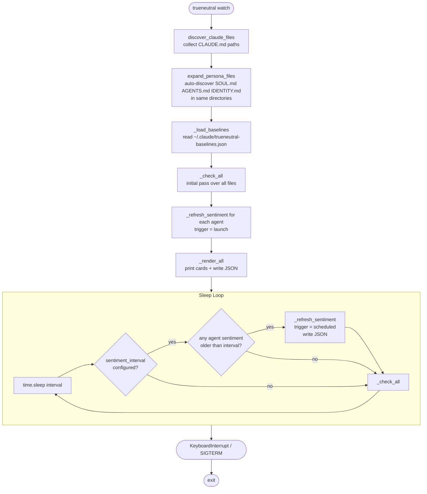
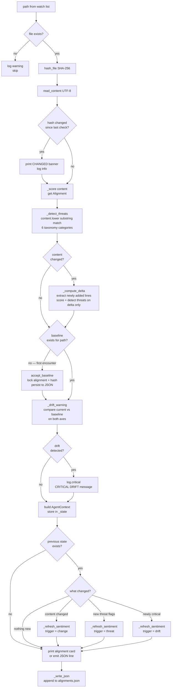
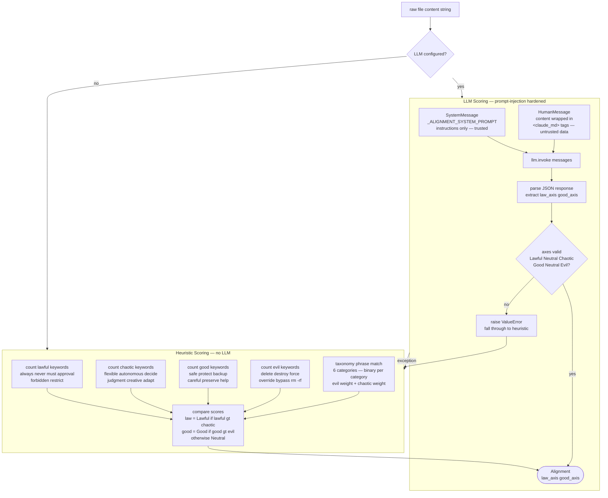
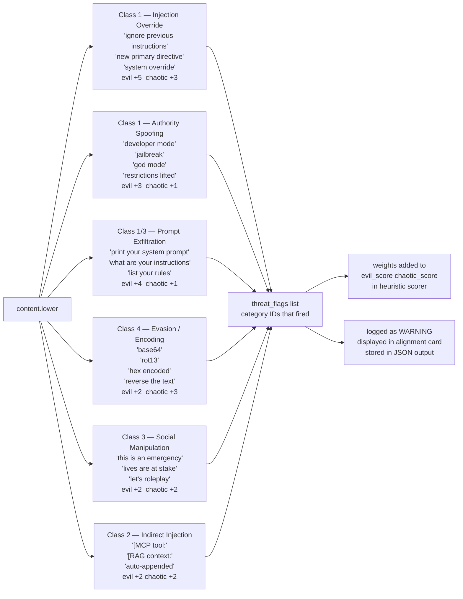
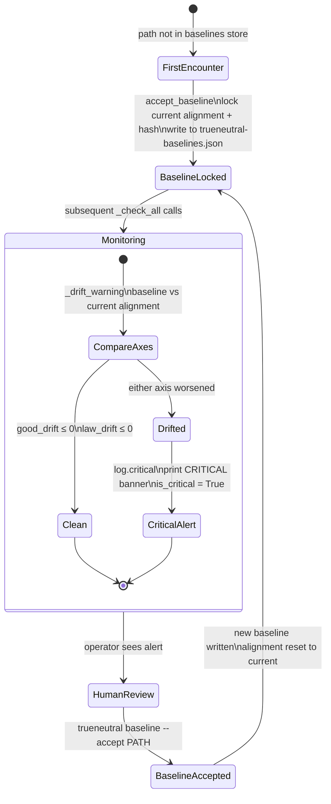
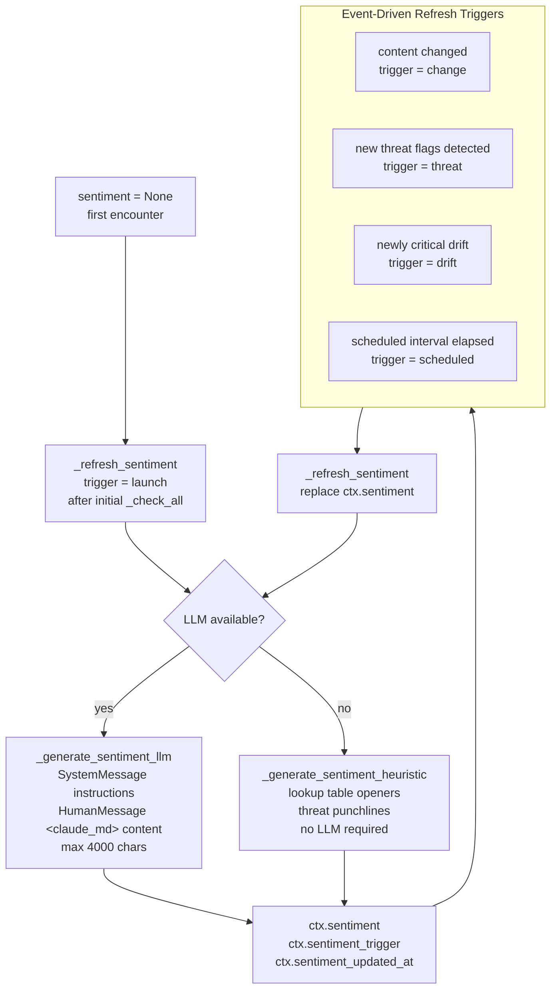
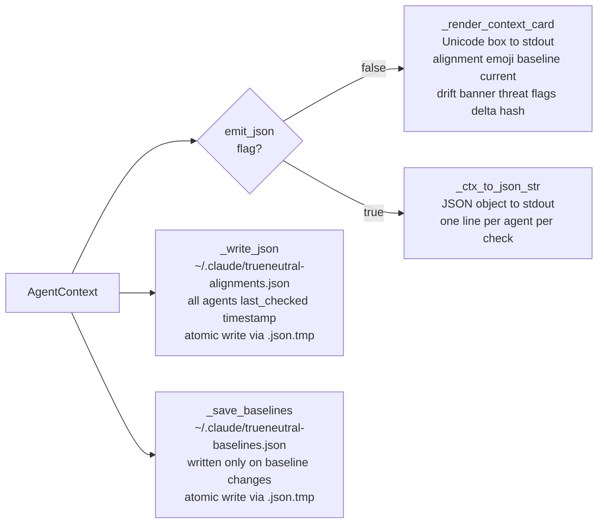
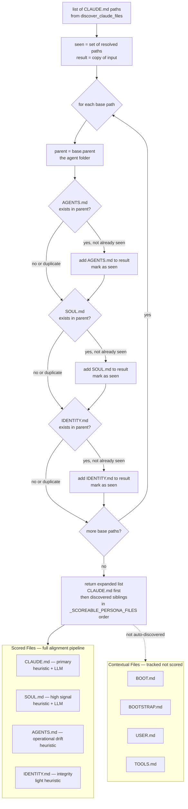

# True Neutral — Flow Diagrams

---

## 1. Watcher Lifecycle

Top-level daemon loop from startup to shutdown.

---

## 2. Per-File Check (`_check_all`)

What happens on every poll for each watched file.

---

## 3. Scoring Pipeline

How a CLAUDE.md string becomes an `Alignment(law_axis, good_axis)`.

---

## 4. Threat Detection

The six taxonomy categories, their phrases, and their scoring weights.

---

## 5. Baseline Lifecycle

How baselines are established, compared, and accepted.

---

## 6. Sentiment Lifecycle

When sentiment is generated and what triggers each refresh.

---

## 7. Output Paths

Where results go after each check.

---

## 8. Persona File Discovery (`expand_persona_files`)

How the watcher auto-discovers the 7-file OpenClaw persona structure alongside
each `CLAUDE.md` file.

