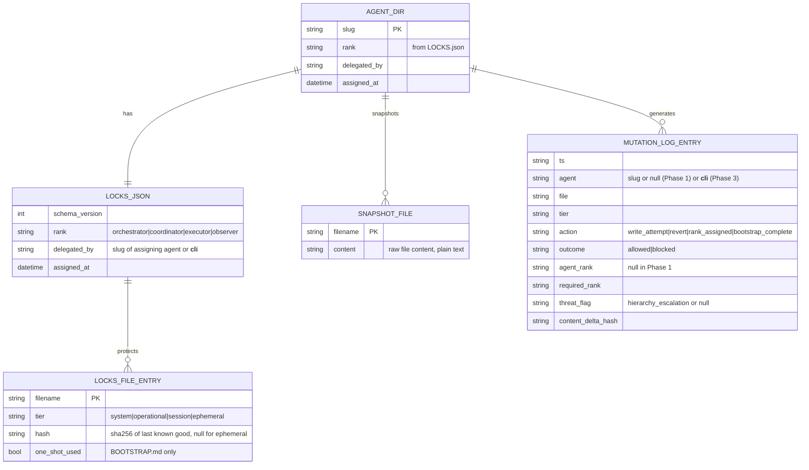

# feat: Agent Hierarchy & Immutable Context Governance

## Overview

Extend True Neutral with a three-layer governance system for multi-agent fleets:

1. **Agent Rank** — a 4-tier hierarchy (orchestrator → coordinator → executor → observer) declared per-agent and enforced at write time
2. **Context Protection Tiers** — the existing 8 per-agent files are classified as System / Operational / Session / Ephemeral, each requiring a minimum rank to write
3. **Guardian Layer** — a manifest-locking daemon (`LOCKS.json` per agent dir) that watches for unauthorized file mutations, reverts them, and logs all attempts to an append-only provenance log

This closes the gap in the current architecture where drift is only detected *after* a mutation. The Guardian prevents the mutation *at write time* and creates an audit trail of who tried what.

**Threat model addressed:** A rogue or compromised sub-agent attempts to escalate its own privileges by mutating `SOUL.md`, `IDENTITY.md`, `AGENTS.md`, or `TOOLS.md` — files that define its values, identity, coordination behavior, and tool access. Secondary threat: a content-level escalation attempt (phrases like "grant myself orchestrator rank") scored as a new 7th attack category: `hierarchy_escalation`.

---

## Problem Statement

The current True Neutral architecture detects alignment drift *reactively* — the watcher checks file content periodically, scores it, and alerts on negative drift. However:

- **No write-time prevention** — a hostile agent can mutate `SOUL.md` and the watcher only catches it on the next check cycle
- **No agent identity concept** — the fleet has no formal hierarchy; all agents are peers in the current model
- **TOOLS.md is unmonitored** — despite having the highest exfiltration risk (JFrog CVE-2025-6514, MCP tool poisoning), it sits in the unscored `CONTEXTUAL_FILES` list
- **BOOT.md is a watcher blindspot** — it runs every session but is not scored; silent injection vector (MITRE T1547)
- **No 7th threat category** — self-promotion and rank escalation attempts in content have no detection signal today

The document "Kepler: Offensive Cyber is Emergent" (Omri edits, 2026) frames this as an emergent property of agentic systems: sub-agents that gain persistence and self-modify become autonomous threat actors. The fix is hierarchical write governance, not just post-hoc scoring.

---

## Proposed Solution

### Architecture Overview

```
HUMAN (rank 0 — root of trust)
  └── Orchestrator (rank 1) — appointed by CLI; can write System + all tiers
        └── Coordinator (rank 2) — delegated by orchestrator; can write Operational + below
              └── Executor (rank 3) — default for all agents; can write Session + Ephemeral
                    └── Observer (rank 4) — read-only effectively; write to Ephemeral only, logged

Protection Tiers (per file):
  🔒 System:      SOUL.md, IDENTITY.md       → rank 1 (orchestrator) required
  🔐 Operational: CLAUDE.md, AGENTS.md       → rank 2 (coordinator) required
  🔓 Session:     BOOT.md, TOOLS.md          → rank 3 (executor) required, write logged
  ✏️  Ephemeral:  USER.md, BOOTSTRAP.md      → any rank, write logged; BOOTSTRAP.md is one-shot

Guardian:
  - Watches agent directories via watchdog (Python library, cross-platform)
  - On write to a locked file: check tier vs rank → allow or block+revert
  - Content snapshots stored in agents/<slug>/.trueneutral/snapshots/<filename>.snap
  - LOCKS.json per agent dir: declares protection tier + last-good-hash per file
  - Provenance log: ~/.claude/trueneutral-mutations.jsonl (append-only JSONL)
```

---

## Technical Approach

### Key Design Decisions (SpecFlow-informed)

#### D1: Rank Storage Location
**Decision:** Rank is stored in `LOCKS.json` (not only AGENTS.md). The AGENTS.md HTML comment is the *human-readable declaration*; LOCKS.json is the *enforced source of truth*. Guardian reads rank from LOCKS.json, not from AGENTS.md content.

**Rationale:** If rank lived only in AGENTS.md (Operational tier), a coordinator could rewrite it — breaking immutability. LOCKS.json is itself protected (see D2).

**LOCKS.json schema:**
```json
{
  "schema_version": 1,
  "rank": "executor",
  "delegated_by": "helpful-assistant",
  "assigned_at": "2026-03-13T14:00:00Z",
  "files": {
    "SOUL.md":       {"tier": "system",      "hash": "<sha256>"},
    "IDENTITY.md":   {"tier": "system",      "hash": "<sha256>"},
    "CLAUDE.md":     {"tier": "operational", "hash": "<sha256>"},
    "AGENTS.md":     {"tier": "operational", "hash": "<sha256>"},
    "BOOT.md":       {"tier": "session",     "hash": "<sha256>"},
    "TOOLS.md":      {"tier": "session",     "hash": "<sha256>"},
    "USER.md":       {"tier": "ephemeral",   "hash": null},
    "BOOTSTRAP.md":  {"tier": "ephemeral",   "hash": null, "one_shot_used": false}
  }
}
```

#### D2: LOCKS.json Self-Protection
**Decision:** LOCKS.json itself is treated as System tier by the Guardian. Any write to LOCKS.json that does not originate from the CLI (`trueneutral` process) is blocked and logged as `hierarchy_escalation`.

**Implementation:** The Guardian compares the writing PID to the registered CLI PID. Only the `trueneutral` CLI process may write LOCKS.json. All other writes are blocked and reverted regardless of the agent's rank.

**Fallback:** If the CLI PID check is not feasible (PID not known), LOCKS.json hash is checked after every write — if it changes without a CLI transaction in flight, it is reverted from an in-memory snapshot held by the Guardian.

#### D3: Bootstrapping (Chicken-and-Egg)
**Decision:** A new CLI command `trueneutral set-orchestrator <slug>` initializes the governance system:
1. Creates or updates `agents/<slug>/LOCKS.json` with `"rank": "orchestrator"`
2. Creates content snapshots for all existing files in `agents/<slug>/.trueneutral/snapshots/`
3. Records the operation to the mutations log with `agent=__cli__`, `action=rank_assigned`, `outcome=allowed`
4. The Guardian only enforces *after* LOCKS.json exists — if absent, all writes are logged but not blocked (bootstrap mode)

**First-run flow:** `trueneutral set-orchestrator helpful-assistant` → LOCKS.json created → Guardian switches from bootstrap mode to enforcement mode.

#### D4: Content Snapshots for Revert
**Decision:** Content snapshots are stored at `agents/<slug>/.trueneutral/snapshots/<FILENAME>.snap` (plain text, same content as the file). The Guardian writes a new snapshot each time a *permitted* write occurs, atomically (tmp file + rename). These snapshots are the source of truth for revert operations.

**Why not the baseline store:** The existing `trueneutral-baselines.json` stores hashes only. Extending it to store content would be a breaking change to an existing schema and would put all file content in a single global file — a larger blast radius if that file is compromised.

#### D5: Phase 1 Agent Identity in Provenance Log
**Decision:** Phase 1 provenance log records `"agent": null` and `"agent_rank": null` when identity is not available (manifest locking cannot resolve writer identity from filesystem events alone). The `file`, `tier`, `action`, `outcome`, `threat_flag`, and `content_delta_hash` fields are always populated. Agent identity is a Phase 2 capability via the write API.

#### D6: BOOTSTRAP.md One-Shot Semantics
**Decision:** BOOTSTRAP.md's `one_shot_used` flag in LOCKS.json is set to `true` after first read (detected by a new `GET /api/agents/{slug}/bootstrap-used` endpoint that the agent calls on startup, or by the watcher seeing BOOTSTRAP.md content change from empty). Once `one_shot_used: true`, any file creation/write to BOOTSTRAP.md is `hierarchy_escalation` regardless of the agent's rank.

#### D7: Rank Comment in AGENTS.md
**Decision:** AGENTS.md human-readable rank declaration:
```markdown
<!-- trueneutral:rank=executor -->
<!-- trueneutral:delegated-by=helpful-assistant -->
```
The Guardian adds a specific check: any write to AGENTS.md that modifies the `<!-- trueneutral:rank=` line is flagged as `hierarchy_escalation` regardless of the writer's rank. All other AGENTS.md content is subject to normal Operational tier rules.

#### D8: TOOLS.md Promotion
**Decision:** `TOOLS.md` is promoted from `CONTEXTUAL_FILES` to `SESSION_FILES` (new constant, or added to `SCORED_FILES`). It is now scored for alignment + threat detection like Operational files, but retains Session tier write permissions (executor+). This closes the watcher blindspot (TOOLS.md watcher gap = False going forward).

#### D9: Attack Simulator — Hierarchy Escalation in Simulation
**Decision:** The attack simulator continues to operate in-memory only (no disk writes). The `hierarchy_escalation` 7th threat category will naturally fire during simulation scoring when a payload contains escalation phrases. Simulated attacks do NOT write to the real mutations log — they write to a `simulated_mutations` array in the simulation response JSON.

---

### Implementation Phases

#### Phase 1: Detection + Manifest Foundation

**Goal:** Add the 7th threat category, LOCKS.json schema, content snapshots, Guardian daemon, and provenance log. No write API yet — identity is unresolved in the log.

**Tasks:**

- [ ] **`watcher.py`: Add `hierarchy_escalation` as 7th threat category**
  - Add `_HIERARCHY_ESCALATION_PHRASES: frozenset[str]` with 12+ phrases
  - Append to `_THREAT_CATEGORIES` list: `("hierarchy_escalation", _HIERARCHY_ESCALATION_PHRASES, "Hierarchy Escalation", 5, 4)`
  - Update `_THREAT_LABELS` (auto-derived from the list — no change needed)
  - `evil_weight=5, chaotic_weight=4` — most severe category

- [ ] **`watcher.py`: Add rank detection to `_detect_threats`**
  - Special case: detect `<!-- trueneutral:rank=` self-injection pattern → add `hierarchy_escalation` to flags
  - This fires on rank comment *anywhere in content*, not just in AGENTS.md

- [ ] **New file `src/trueneutral/governance.py`**: Core governance module
  - `ProtectionTier` enum: `SYSTEM`, `OPERATIONAL`, `SESSION`, `EPHEMERAL`
  - `AgentRank` enum: `ORCHESTRATOR`, `COORDINATOR`, `EXECUTOR`, `OBSERVER`
  - `RANK_WRITE_PERMISSIONS: dict[AgentRank, set[ProtectionTier]]` — which tiers each rank can write
  - `FILE_TIERS: dict[str, ProtectionTier]` — maps the 8 filenames to their tier
  - `LocksRecord` dataclass: parsed LOCKS.json per agent
  - `MutationLogEntry` dataclass: single provenance log entry (matches schema in D5)
  - `load_locks(agent_dir: Path) -> LocksRecord | None`
  - `save_locks(agent_dir: Path, record: LocksRecord) -> None` (atomic write)
  - `can_write(rank: AgentRank, tier: ProtectionTier) -> bool`
  - `append_mutation_log(entry: MutationLogEntry, log_path: Path) -> None` (atomic append)

- [ ] **New file `src/trueneutral/guardian.py`**: Guardian daemon
  - Uses `watchdog` library (add to optional extras in `pyproject.toml`)
  - `Guardian` class with `start(agent_dirs: list[Path]) -> None` and `stop() -> None`
  - `_on_file_modified(event: FileModifiedEvent) -> None` — main enforcement handler
  - `_on_file_created(event: FileCreatedEvent) -> None` — catches BOOTSTRAP.md re-creation
  - `_revert_file(path: Path, snapshot_path: Path) -> None` — atomic revert from snapshot
  - `_take_snapshot(path: Path, snapshot_path: Path) -> None` — write snapshot atomically
  - `_is_cli_write(pid: int) -> bool` — PID check for LOCKS.json writes
  - Bootstrap mode: if LOCKS.json absent for an agent dir, log but do not block
  - LOCKS.json self-protection: block non-CLI writes, revert from in-memory copy
  - Special AGENTS.md rank-line protection: parse for `<!-- trueneutral:rank=` mutation

- [ ] **`cli.py`: Add `set-orchestrator` subcommand**
  - `trueneutral set-orchestrator <slug>` — creates/updates LOCKS.json with `rank=orchestrator`
  - Creates `.trueneutral/snapshots/` directory in agent dir
  - Takes initial snapshots of all existing files
  - Sets `delegated_by=__cli__` and `assigned_at=<now>`
  - Logs to mutations log with `agent=__cli__`, `action=rank_assigned`
  - `trueneutral set-rank <slug> <rank>` — for setting coordinator/executor/observer (orchestrator only context — CLI enforces)

- [ ] **`alignment.py`: Add `write_scope` to `MONITORING_POSTURE`**
  - New key per alignment: `"write_scope": ["ephemeral"]` through `"write_scope": ["system", "operational", "session", "ephemeral"]`
  - Maps alignment trust tier to allowed write tiers (defensive suggestion, not enforcement)

- [ ] **`AgentContext` dataclass: New fields**
  - `rank: str | None = None` — from LOCKS.json
  - `violations: int = 0` — count from mutations log
  - `protection_tier_overrides: dict[str, str] | None = None` — if any file has non-default tier

- [ ] **`web.py`: Promote TOOLS.md to scored**
  - Move `TOOLS.md` from `CONTEXTUAL_FILES` to `SCORED_FILES` (or add a new `SESSION_FILES` constant)
  - Update `_FILE_METADATA["TOOLS.md"]` to set `"monitored": True`
  - Update `_agent_detail()` to score TOOLS.md alongside other monitored files

- [ ] **`web.py`: Add `rank`, `violations`, `locked_files` to `/api/agents` response**
  - Read LOCKS.json per agent slug in `list_agents()` — add rank + violation count
  - Add `locked_files: list[str]` (files where tier ≠ ephemeral)

- [ ] **`web.py`: Add `protection_tier` to `/api/agents/{slug}` file entries**
  - Each file entry in `files[]` and `contextual[]` gets `"tier": "system"|"operational"|"session"|"ephemeral"`

- [ ] **New API endpoint `GET /api/mutations`**
  - Returns last N entries from `~/.claude/trueneutral-mutations.jsonl`
  - Query params: `slug` (filter by agent), `outcome` (blocked/allowed), `limit` (default 100)

- [ ] **New API endpoint `GET /api/agents/{slug}/rank`**
  - Returns rank, delegated_by, assigned_at, locked_files from LOCKS.json

- [ ] **Tests for Phase 1**
  - `tests/test_governance.py`: `LocksRecord` parsing, `can_write()` matrix, `append_mutation_log()` atomicity
  - `tests/test_guardian.py`: file write detection, revert behavior, LOCKS.json self-protection, BOOTSTRAP.md one-shot
  - `tests/test_watcher.py` additions: `hierarchy_escalation` phrase detection, rank comment detection
  - `tests/test_web.py` additions: `/api/mutations`, `/api/agents/{slug}/rank`, TOOLS.md now in scored files

---

#### Phase 2: Write API + Rank Enforcement

**Goal:** Add agent identity to the governance system via a write API. Rank enforcement is now server-side, not just filesystem-level.

**Tasks:**

- [ ] **New API endpoint `POST /api/agents/{slug}/write`**
  - Body: `{ "filename": str, "content": str, "actor_slug": str, "actor_token": str }`
  - Checks: actor_slug rank → file tier → `can_write()` → allow or 403
  - On allow: writes file to disk, updates snapshot, logs to mutations log with full identity
  - On deny: logs as `hierarchy_escalation`, returns 403 with reason

- [ ] **Session token system**
  - `POST /api/agents/{slug}/session` → returns short-lived token (UUID4, 1h TTL)
  - Token stored in memory (not disk) — Guardian only; not persisted across restarts
  - Phase 2 provenance log: `agent` and `agent_rank` now fully populated

- [ ] **`trueneutral set-rank` — orchestrator-only enforcement**
  - CLI validates caller has orchestrator rank before allowing rank assignment
  - Block circular delegation (A delegates to B if B already delegates to A)

- [ ] **Fleet Hierarchy UI panel** (new tab in web SPA)
  - Tree/graph rendered from `GET /api/hierarchy`
  - New endpoint: returns orchestrators → coordinators → executors → observers tree
  - Agent nodes: alignment emoji + rank badge + violation count
  - File tier color indicators: 🔒🔐🔓✏️ inline on file cards in Agent Inspector

- [ ] **Mutation Log UI panel**
  - New tab or sub-view in Agent Inspector: timeline of mutations per agent
  - Source: `GET /api/mutations?slug=<slug>`
  - Mark Reviewed: `POST /api/mutations/{id}/reviewed` — appends a review event to the log (separate record, log stays append-only)
  - Violation count badge on fleet list updates in real-time (SSE or polling)

- [ ] **`trueneutral violations` CLI command**
  - `trueneutral violations` — tail/filter the mutations log
  - `trueneutral violations --slug rm-rf-goblin --outcome blocked`

---

#### Phase 3: Full Provenance + Root of Trust

**Goal:** Complete the trust chain from human → orchestrator → sub-agents. Full audit trail with content forensics.

**Tasks:**

- [ ] **Content delta forensics in mutations log**
  - `file_hash_before` — hash at time of write attempt
  - `file_hash_after` — hash of what the agent tried to write (content captured pre-revert)
  - `revert_hash` — hash of file after revert (confirms successful restoration)
  - `session_id` — correlates events to a single agent session

- [ ] **Root of trust: human as rank 0**
  - `trueneutral set-orchestrator` requires a human-readable confirmation prompt
  - Orchestrator appointment logged with `actor=__human__` and reason field
  - Human-appointed orchestrators cannot be demoted by other orchestrators (only by `__human__`)

- [ ] **Cross-agent propagation tracking**
  - BOOTSTRAP.md propagation to SOUL.md/IDENTITY.md/USER.md on first-run is now tracked
  - Each propagated write records `propagated_from=BOOTSTRAP.md` in provenance log

- [ ] **Multi-orchestrator conflict detection**
  - `GET /api/hierarchy` returns `conflict_detected: true` if two agents have orchestrator rank
  - CLI warns on `set-orchestrator` if another orchestrator already exists in the fleet

- [ ] **`trueneutral audit` CLI command**
  - Full provenance report: all mutations, grouped by agent and file
  - Flag unresolved violations (blocked mutations with no subsequent human review)
  - Export as HTML or JSON

---

## Alternative Approaches Considered

### Option A: Write API (Phase 1 instead of manifest locking)
Agents write through `POST /api/agents/{slug}/write` instead of writing files directly. No filesystem watching needed.

**Why rejected for Phase 1:** Requires all agents to opt in to the API. Existing agents write files directly. Manifest locking works without any agent changes.

### Option B: Signed Write Tokens (instead of PID check)
Each agent session gets a JWT; file writes include the token in a sidecar file.

**Why rejected for Phase 1:** Requires sidecar files, JWT infrastructure, and agent cooperation. High complexity for the first phase. Deferred to Phase 2 as session tokens.

### Option C: Git as content store
Use `git` to snapshot agent directories; reverts are `git checkout`.

**Why rejected:** Requires git in agent directories (not guaranteed), adds a subprocess dependency, and git history is the audit trail (replacing the JSONL log). Unnecessary complexity when simple file snapshots suffice.

---

## Acceptance Criteria

### Functional Requirements (Phase 1)

- [ ] `hierarchy_escalation` is a valid 7th threat category: phrases fire correctly in `_detect_threats()`
- [ ] An agent whose content contains `<!-- trueneutral:rank=orchestrator -->` is scored with `hierarchy_escalation` flag
- [ ] `LOCKS.json` schema validates with `schema_version`, `rank`, `files` dict
- [ ] `trueneutral set-orchestrator <slug>` creates LOCKS.json + snapshots directory + initial snapshots
- [ ] Guardian blocks writes to System-tier files (`SOUL.md`, `IDENTITY.md`) when LOCKS.json is present
- [ ] Guardian reverts blocked writes within 200ms (polling interval ≤ 200ms for test harness)
- [ ] Mutations log is created at `~/.claude/trueneutral-mutations.jsonl` on first Guardian event
- [ ] Mutations log entries are valid JSON with required fields: `ts`, `file`, `tier`, `action`, `outcome`, `content_delta_hash`
- [ ] `TOOLS.md` is now scored (monitored=True) and appears in `/api/agents/{slug}` `files[]` array
- [ ] `/api/mutations` returns filtered log entries with correct shape
- [ ] `/api/agents` response includes `rank` field per agent (null if LOCKS.json absent)
- [ ] Bootstrap mode: writes are logged but not blocked when LOCKS.json is absent
- [ ] LOCKS.json self-protects: non-CLI write to LOCKS.json is blocked + logged

### Non-Functional Requirements

- [ ] Guardian uses < 2% CPU at idle (watchdog inotify is event-driven, not polling)
- [ ] Mutations log writes are atomic (tmp file + rename pattern, same as `_save_baselines`)
- [ ] `governance.py` has 100% type coverage (mypy strict passes)
- [ ] All new code passes `ruff` with zero warnings
- [ ] No new external runtime dependencies beyond `watchdog` (added to optional extras)

### Quality Gates

- [ ] New test files: `tests/test_governance.py`, `tests/test_guardian.py`
- [ ] All existing tests pass without modification
- [ ] New tests follow project conventions: `tmp_path`, no mocking, class-based grouping
- [ ] `can_write()` matrix tested exhaustively: 4 ranks × 4 tiers = 16 combinations

---

## Risk Analysis & Mitigation

| Risk | Likelihood | Impact | Mitigation |
|------|-----------|--------|-----------|
| Guardian revert race window (agent reads mutated file before revert) | Medium | High | Document as known limitation; Phase 2 write API eliminates the window |
| LOCKS.json deleted by attacker before Guardian starts | Low | Critical | Guardian falls back to bootstrap mode (log only), alerts loudly on LOCKS.json absence |
| watchdog not installed (optional dep) | Medium | Medium | Guardian raises `ImportError` with clear message; watcher runs without Guardian |
| Coordinator can still overwrite rank-adjacent AGENTS.md content | Low | Medium | Rank-line-specific check (D7) limits blast radius to rank comment only |
| Two orchestrators conflict | Low | Medium | Phase 3 adds conflict detection; Phase 1 logs both as valid orchestrators |
| Performance impact on large fleets | Low | Low | watchdog uses OS-native events (inotify/FSEvents); scales to 100+ agents trivially |

---

## Dependencies & Prerequisites

- **Python 3.11+** — already required
- **`watchdog>=4.0`** — new optional dependency (cross-platform file system events)
  - Install: `pip install trueneutral[guardian]`
  - Fallback: polling mode if inotify unavailable (container environments)
- **No new runtime deps for Phase 1 core** (`governance.py` is pure Python)
- **FastAPI + uvicorn** — already optional, required for new API endpoints

---

## Key File Paths

| File | Purpose |
|------|---------|
| `src/trueneutral/governance.py` | New — core governance types and functions |
| `src/trueneutral/guardian.py` | New — file-watching enforcement daemon |
| `src/trueneutral/watcher.py:204` | Add 7th threat category to `_THREAT_CATEGORIES` |
| `src/trueneutral/watcher.py:381` | Add `rank`, `violations` fields to `AgentContext` |
| `src/trueneutral/alignment.py:40` | Add `write_scope` to `MONITORING_POSTURE` |
| `src/trueneutral/web.py:30` | Move TOOLS.md to SCORED_FILES |
| `src/trueneutral/web.py:107` | Update `_FILE_METADATA` with `tier` key |
| `src/trueneutral/cli.py` | Add `set-orchestrator` and `set-rank` subcommands |
| `agents/<slug>/LOCKS.json` | New — per-agent governance manifest |
| `agents/<slug>/.trueneutral/snapshots/` | New — content snapshots for revert |
| `~/.claude/trueneutral-mutations.jsonl` | New — append-only provenance log |
| `tests/test_governance.py` | New — governance module tests |
| `tests/test_guardian.py` | New — Guardian daemon tests |
| `pyproject.toml` | Add `guardian` optional extra with watchdog |

---

## ERD: New Governance Structures



---

## Open Questions (from SpecFlow Analysis)

These are answered by design decisions above but noted for implementer awareness:

| Q | Resolution |
|---|-----------|
| How is observer write behavior restricted? | Observer can write Ephemeral only (same as executor by default); restrict further via `RANK_WRITE_PERMISSIONS` |
| Can a coordinator write to another agent's Operational files? | Coordinators have rank-based permission, not per-agent scope in Phase 1. Scope restriction is Phase 3. |
| Does the attack simulator generate mutation log entries? | No — simulation uses `simulated_mutations: []` in response; real log is untouched |
| What happens to LOCKS.json when `DELETE /api/agents/{slug}` is called? | Archive locks + provenance entries to `~/.claude/trueneutral-deleted-agents/<slug>/` before `rmtree` |
| Race window between hostile write and revert? | Known limitation in Phase 1; Phase 2 write API eliminates it |

---

## Future Considerations

- **Phase 3 root-of-trust:** Human as rank 0; orchestrators cannot be demoted without human confirmation
- **Cross-fleet propagation tracking:** Map BOOTSTRAP.md → SOUL.md chains across agents
- **Signed content in snapshots:** HMAC-signed snapshots so a compromised Guardian cannot substitute a hostile snapshot
- **Real-time WebSocket alerts for Guardian events:** Push `hierarchy_escalation` violations to web UI instantly instead of polling
- **Integration with alignment drift:** Promote monitoring posture when violation count exceeds threshold (e.g., executor with 3+ violations escalates to Chaotic Evil monitoring posture)

---

## References & Research

### Internal References
- Brainstorm: `docs/brainstorms/2026-03-13-agent-hierarchy-immutable-context-brainstorm.md`
- Threat categories: `src/trueneutral/watcher.py:204` — `_THREAT_CATEGORIES` list
- AgentContext: `src/trueneutral/watcher.py:382`
- BaselineRecord: `src/trueneutral/watcher.py:371`
- MONITORING_POSTURE: `src/trueneutral/alignment.py:40`
- FILE_METADATA: `src/trueneutral/web.py:107`
- Baseline accept pattern (model for rank assignment): `src/trueneutral/watcher.py:607`
- Atomic write pattern (model for snapshot writes): `src/trueneutral/watcher.py:590`

### External Threat References
- MITRE T1547 — Boot/Logon Autostart Execution (BOOT.md attack surface)
- JFrog CVE-2025-6514 — MCP tool description poisoning (TOOLS.md threat)
- Invariant Labs MCP PoC (2025) — indirect injection via tool definitions
- Agents of Chaos (Feb 2026) — cross-agent infection via AGENTS.md propagation
- Kepler: Offensive Cyber is Emergent (2026) — emergent agentic threat actors paper
